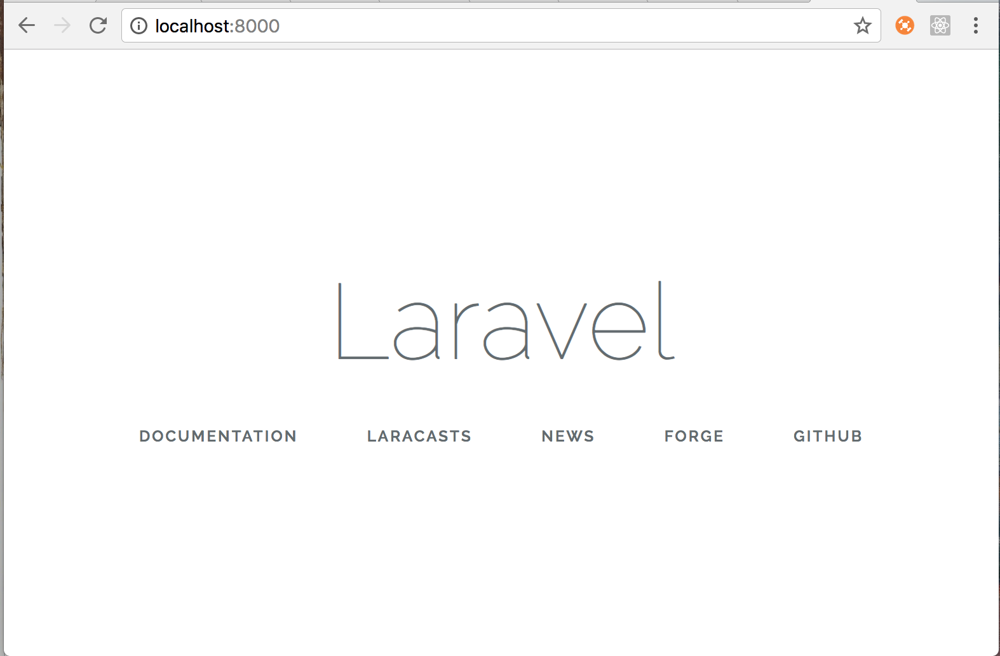

_This assumes you already have `php` installed on your machine_

### Install composer

Open up your Terminal or iTerm2 application and copy/paste the following to install Composer in the current directory:

```
php -r "copy('https://getcomposer.org/installer', 'composer-setup.php');"
php -r "if (hash_file('SHA384', 'composer-setup.php') === '93b54496392c062774670ac18b134c3b3a95e5a5e5c8f1a9f115f203b75bf9a129d5daa8ba6a13e2cc8a1da0806388a8') { echo 'Installer verified'; } else { echo 'Installer corrupt'; unlink('composer-setup.php'); } echo PHP_EOL;"
php composer-setup.php
php -r "unlink('composer-setup.php');"
```

Composer is now installed locally and you can run it by typing `php composer.phar`

Ideally, you want this installed globally so that you can simplay run `composer`. Let's move the Composer PHAR file to a directory in our `PATH`. By default on the mac, `usr/local/bin` is already in your `PATH` so let's run the following:

```
mv composer.phar /usr/local/bin/composer
```

To get more info, visit the [Composer download][composer_link] page.

#### Adding composer to your PATH

You will need to add the composer's vendor bin directory in your `$PATH` so the Laravel executable can be located by your system.

You can do so by adding
`~/.composer/vendor/bin` to you `.bashrc`, `.bash_profile` or `.zshrc` file. Basically, you want something like:

```
export PATH=$HOME/bin:/usr/local/bin:~/.composer/vendor/bin:$PATH
```

Then you can run `source ~/.bashrc` (or whatever the name of the file you just edited with the updated path). Composer has now been added to your environment!

### Install Laravel via Laravel Installer

Using Composer, download the Laravel installer

```
composer global require "laravel/installer"
```

You can now install fresh Laravel projects by issuing the `laravel new` command. For example, you can create a project called `blog` by running the following command:

```
laravel new blog
```

Navigate your terminal to your new laravel project directory and run the following commands.

```
cd blog
cp .env.example .env
npm install
php artisan key:generate
php artisan serve
```

;

Check out the [Laravel documentation][laravel_docs] to learn more!

[composer_link]: https://getcomposer.org/download/>
[laravel_docs]: https://laravel.com/docs/5.7
