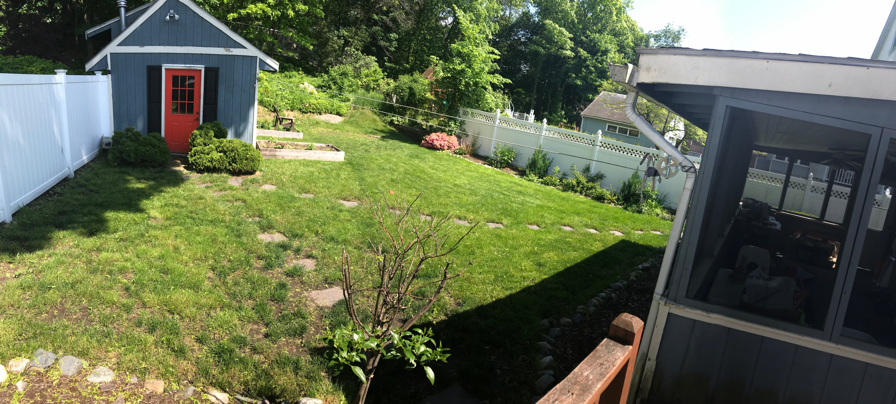

I didn't like the look of the original paths because the pavers were spread out and it would require more lawn maintainence, having to edge around each paver, so I repurposed them into one walkway from our deck to the shed. We went from this:

To this:

Here is a little timelapse I put together to show the process:
`youtube: JbrWBpUBBIg`
