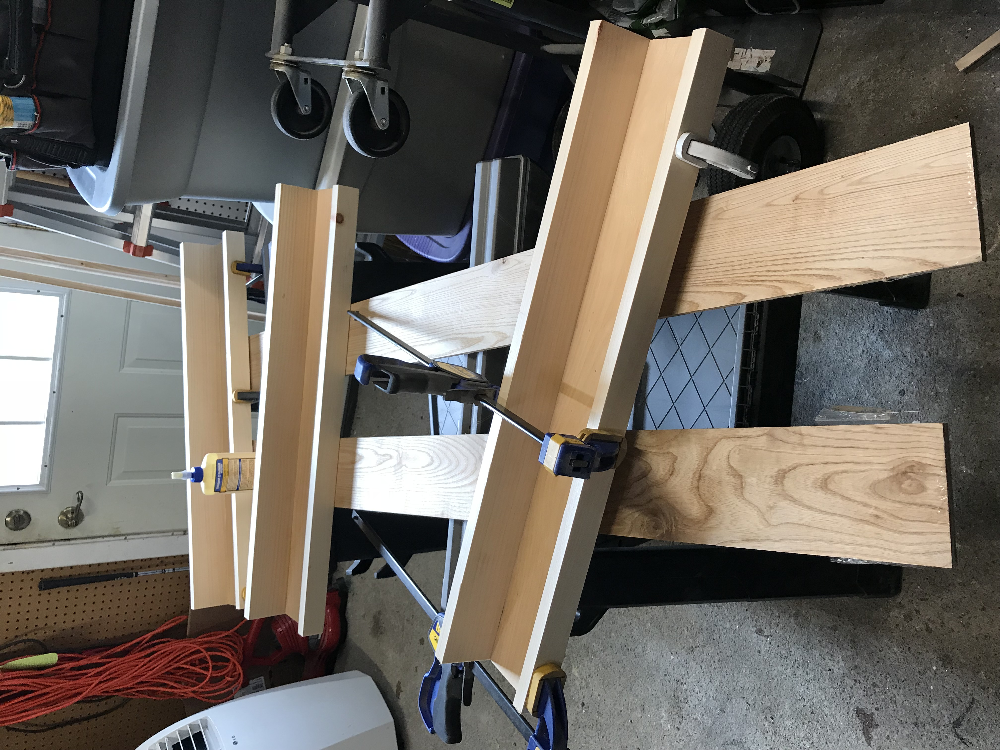

My wife and I are expecting our first child in early October and have begun the transformation of guest room to baby room. The room is a little small but we are managing to make it all work. There is one wall, where the door opens into the room, that is just too small to put any furniture against so we have decided to hang some shelves to display our baby's books.

A quick google search of **_floating shelves baby books_** turned up just the inspiration I needed to get this project rolling.

For our space, we decided to make the shelves 30" wide. We also decided that we wanted to use 1"x4" boards for the bottom and back pieces and 1"x2" for the front lip.

## Supplies

(1) - 1" x 2" x 8' - [1x2x8 - HomeDepot link](https://www.homedepot.com/p/1-in-x-2-in-x-8-ft-Premium-Kiln-Dried-Square-Edge-Whitewood-Common-Board-914584/100037592)

(2) - 1" x 4" x 8' - [1x4x8 - HomeDepot link](https://www.homedepot.com/p/1-in-x-4-in-x-8-ft-Premium-Kiln-Dried-Square-Edge-Whitewood-Common-Board-914681/100023465)

(1) - Wood Glue - [Titebond II Premium Wood Glue](https://amzn.to/2DpUl2s)

(3) - Clamps - [IRWIN QUICK-GRIP One-Handed Mini Bar Clamps](https://amzn.to/2APCyza)

(1) - White paint - [Interior semi-gloss white paint](https://amzn.to/2QmJt8d)

## Directions

### Step 1

Cut your lumber into 30" pieces. If you do not have a saw at home, ask Home Depot to make the cuts for you. They will usually do it for free!

### Step 2

Gather two of the 4" x 30" pieces and one of the 2" x 30" pieces. This makes one shelf. You will be able to make 3 - 30" shelves.

### Step 3

Line up the boards so that one of the 4" boards is flat on the ground and one is butted up against it. Then take the 2" piece and butt that up against the other side of the flat 4" piece. The picture below shows an example.

### Step 4

Glue the boards together. Once you have them lined up, run the wood glue along both sides of the board and then clamp everything together. I used 3 small clamps, one on each end and one in the middle. Remember, check your edges while clamping to make sure everything is still lined up. When you are statisfied, clamp everything really well and let the glue dry for about an hour.

### Step 5

Once the shelves are all glued up, it's time to paint! Grab your color of choice and give them a couple of coats.

### Step 6

Preparing to hang the shelves. This step can be achieved in many ways. Luckily, I have a [Bosch Plunge Router](https://amzn.to/2JK7jIt) and was able to buy a [keyhole bit](https://amzn.to/2F8H9Rk) for it. Using the router, I was able to cut two keyhole slots in the back of the shelves so that I can just drill screws into the walls and slide the shelves onto the screws.

You can see in the video below that I made a jig to guide the router and to minimize any possible errors I could make. This was as simple as making a few measurements and then screwing some scrap wood together.
`youtube: 6Z1jjFdY0e8`

`youtube: EfTlHoRik6A`

Here is a quick video to show you how the screw and keyhole slot work:
`youtube: nvCSdDpg-Eg`

If you don't own a router or if that process seems too difficult, simply drill pilot holes in the back of the shelves and then screw them into the wall.

### Step 7

Hang the shelves! I managed to find two studs on the wall and cut my keyholes to line up on those studs. This made hanging the shelves a breeze. If I ever need to relocate them, I can slide them right up and off the wall.

I hope you enjoyed this little tutorial on how to make your own floating shelves. If you'd like to see more of this content, please leave a comment below!

<!-- https://youtu.be/

https://youtu.be/ -->
