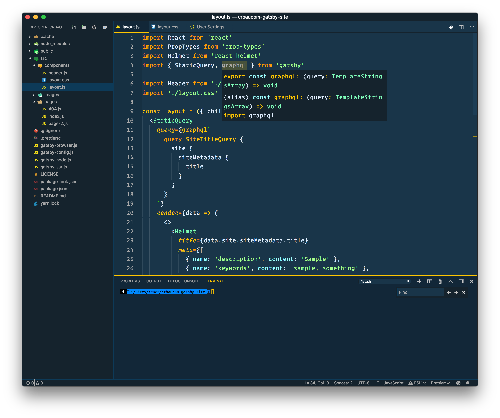
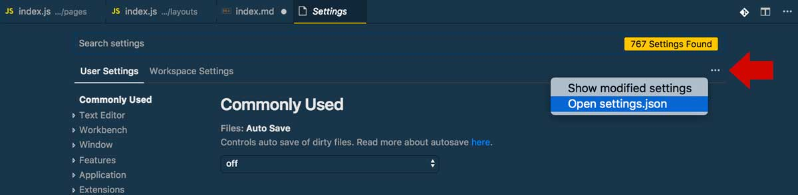
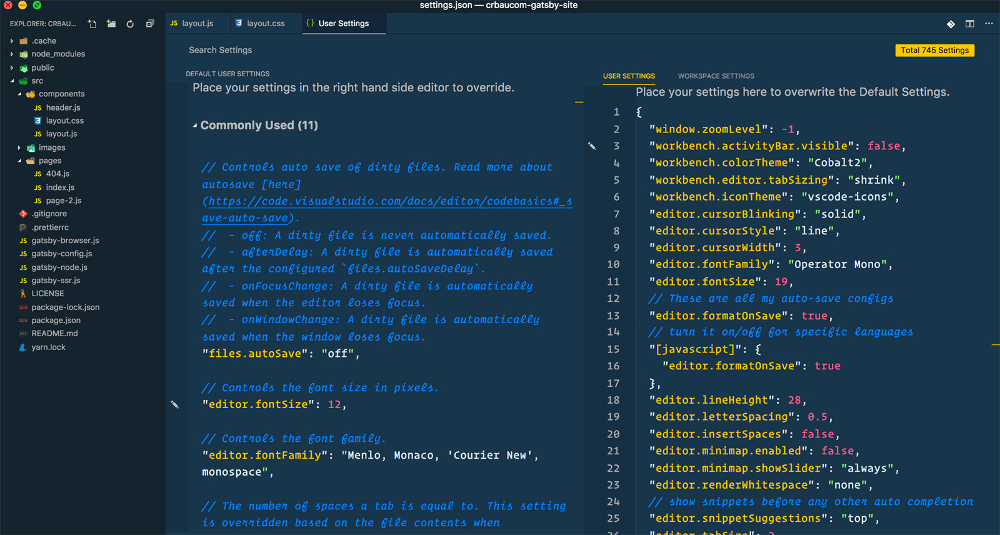

Visual Studio Code has been my editor of choice for the past year or so. I love the fact that it is customizable, open-source, and free! Below, I walk through some of the extensions I use and share my custom settings.

### Install VS Code

If you haven't already downloaded and installed VS Code, click [here][vscode_link].

### Extensions

I personally have a lot of language and framework specific extensions installed to meet my needs as a developer. I have created a Gist on Github using the [Settings Sync](https://marketplace.visualstudio.com/items?itemName=Shan.code-settings-sync) extension. You can find a full list of them [here](https://gist.github.com/cbaucom/d46e82e43b4306c036f9fae0f744bcf2).

### Theme

I'm a big [Wes Bos](https://wesbos.com/) fan and have been using his [Cobalt2 Theme](https://marketplace.visualstudio.com/items?itemName=wesbos.theme-cobalt2) for a while now. It has almost 117,000 installs at the time of this writing! Make sure you follow the instructions, especially the CSS Hacks, for best experience.



### Custom Settings

To modify the default settings, navigate to `Code > Preferences > Settings` or press `CMD + ,`. You should see something similar to the screen shot below. If not, you may need to click on the three little dots on the right and then select 'Open settings.json'.





Here is how my settings.json file looks

```
{
  "window.zoomLevel": -1,
  "workbench.activityBar.visible": false,
  "workbench.colorTheme": "Cobalt2",
  "workbench.editor.tabSizing": "shrink",
  "workbench.iconTheme": "vscode-icons",
  "editor.cursorBlinking": "solid",
  "editor.cursorStyle": "line",
  "editor.cursorWidth": 3,
  "editor.fontFamily": "Operator Mono",
  "editor.fontSize": 19,
  // These are all my auto-save configs
  "editor.formatOnSave": true,
  // turn it on/off for specific languages
  "[javascript]": {
    "editor.formatOnSave": true
  },
  "editor.lineHeight": 28,
  "editor.letterSpacing": 0.5,
  "editor.insertSpaces": false,
  "editor.minimap.enabled": false,
  "editor.minimap.showSlider": "always",
  "editor.renderWhitespace": "none",
  // show snippets before any other auto completion
  "editor.snippetSuggestions": "top",
  "editor.tabSize": 2,
  "editor.wordWrap": "on",

  "emmet.includeLanguages": {
    "html": "html",
    "blade": "html",
    "javascript": "javascriptreact",
    "vue": "html",
    "ejs": "html"
  },
  "emmet.triggerExpansionOnTab": true,
  "eslint.autoFixOnSave": true,
  "eslint.alwaysShowStatus": true,
  "explorer.openEditors.visible": 0,
  "files.trimTrailingWhitespace": true,
  "html.format.enable": true,
  "html.format.preserveNewLines": true,
  "vscode_custom_css.imports": [
    "file:///Users/cbaucom/dev/dot-dev/vscode-styles.css"
  ],
  "terminal.external.osxExec": "iTerm.app",
  "terminal.integrated.shell.osx": "zsh",
  "dart.flutterSdkPath": "/Users/cbaucom/dev/flutter",
  "sync.gist": "d46e82e43b4306c036f9fae0f744bcf2",
  "sync.quietSync": false,
  "sync.removeExtensions": true,
  "sync.syncExtensions": true,
  "sync.autoDownload": false,
  "sync.autoUpload": false,
  "sync.forceDownload": false
}
```

[vscode_link]: https://code.visualstudio.com/>
