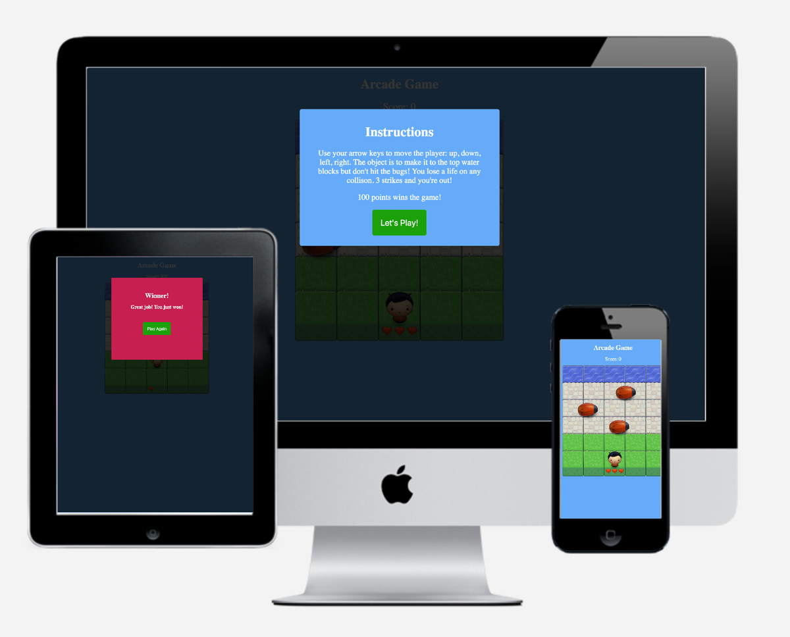

## Installation

- Download the repository [here](https://github.com/cbaucom/fend-arcade-game.git).
- Navigate to where you downloaded the files.
- Double-click index.html to open the game in your browser.

## How The Game Works

In this game you have a Player and Enemies (Bugs).

The goal of the player is to reach the water, without colliding into any one of the enemies. The player can move left, right, up and down. The enemies move in varying speeds on the paved block portion of the scene. Once a the player collides with an enemy, a life is lost and the player moves back to the start square. If you lose all 3 lives, the game is reset. Once the player reaches the water, 10 points is added to the player's score. Once the player gets 100 points, the game is won.

<a href="https://cbaucom.github.io/fend-arcade-game/" class="btn">Play the game</a>

