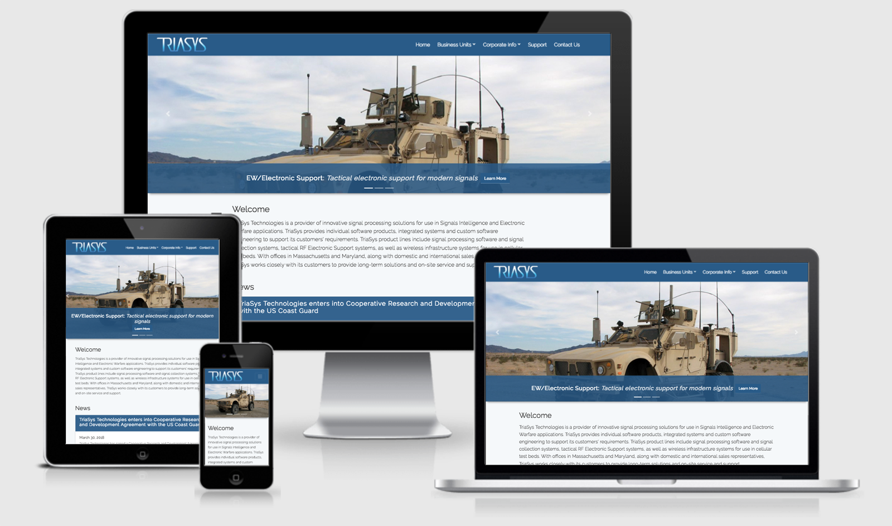
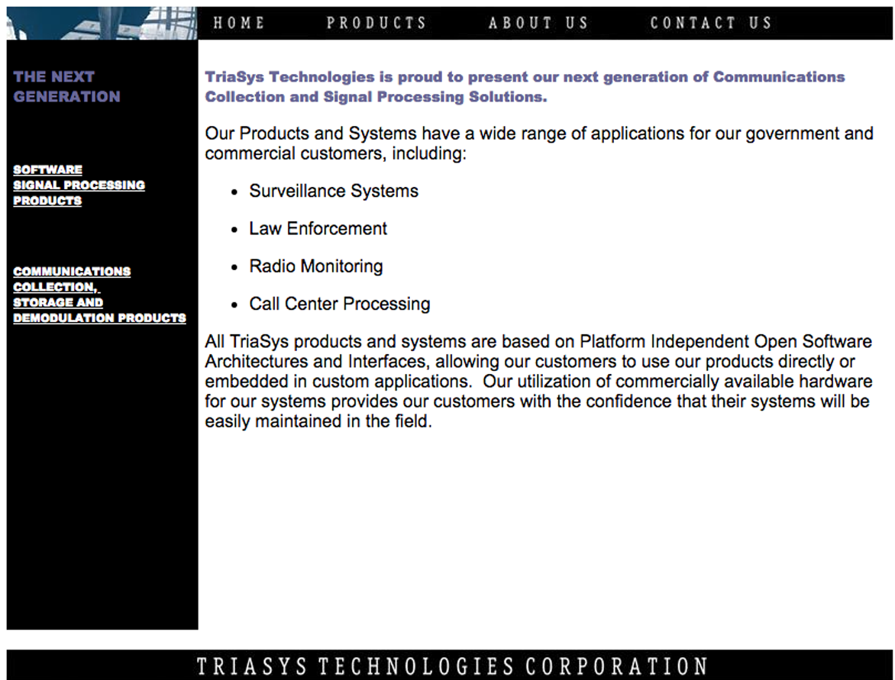
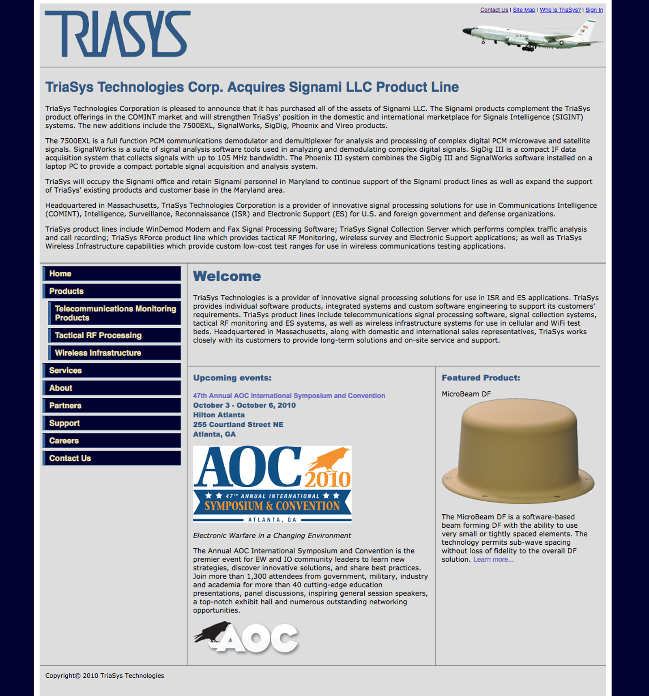
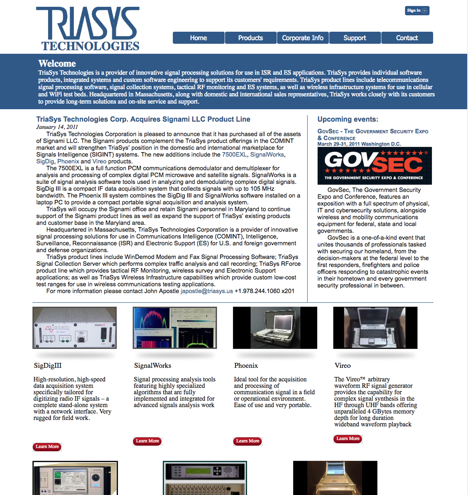
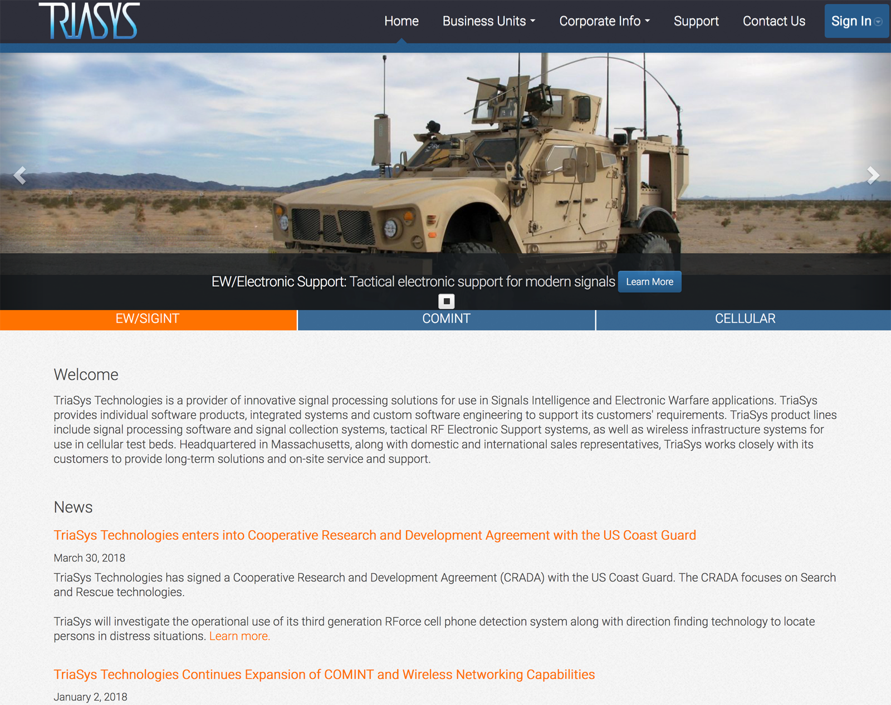
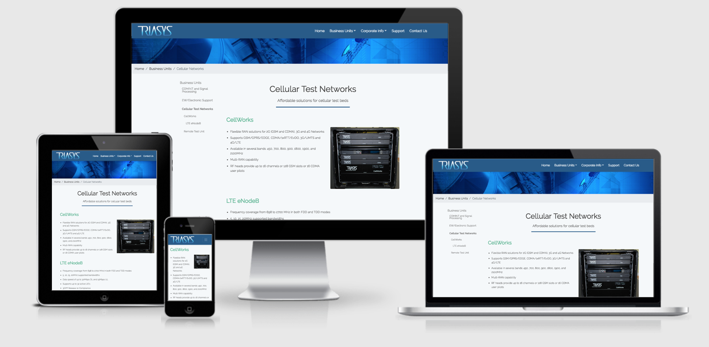

#####TriaSys Technologies is a leading provider of innovative signal processing solutions for use in Signals Intelligence and Electronic Warfare applications.

I started working for TriaSys in 2007. I noticed that the company website was out-dated, boring, and straight up ugly! It had a fixed width of 600 pixels and used inline styles everywhere!

Around 2009, I started to teach myself HTML and CSS. As a side project, I began to redesign the site. First, I redesigned the static site.

It was still pretty ugly, but I was just learning! In 2011 I had my mind blown when I read Ethan Marcotte's, Responsive Web Design, and quickly began to reconstruct the site again. This time, designing for the flexibility of multiple screen sizes.

The site has been enhanced over the years. Adding in a database and some PHP code to manage customer logins and support pages.

Recently, I've discovered the Laravel framework and really enjoy using it. Check out my [blog post](/blog/2017/setting-up-your-mac-for-laravel-development/) on how to get started with Laravel on Mac OS.

<a href="https://triasys.crbaucom.com" class="btn">Visit the live site</a>

